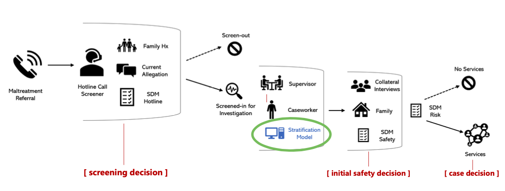
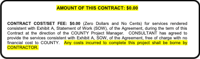
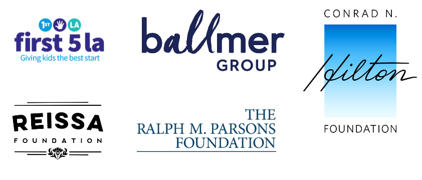
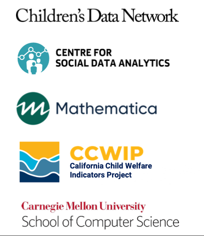
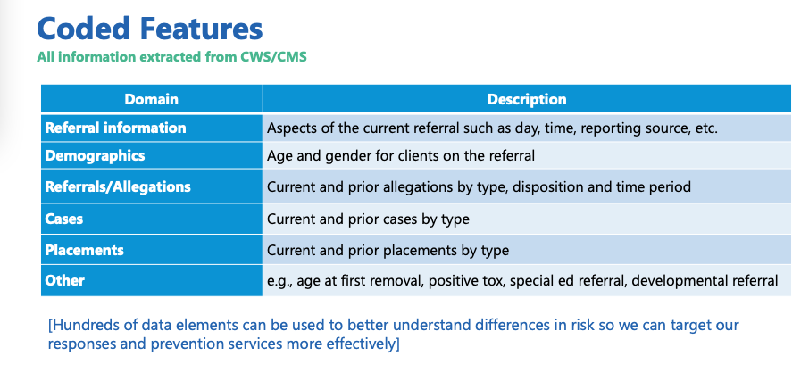
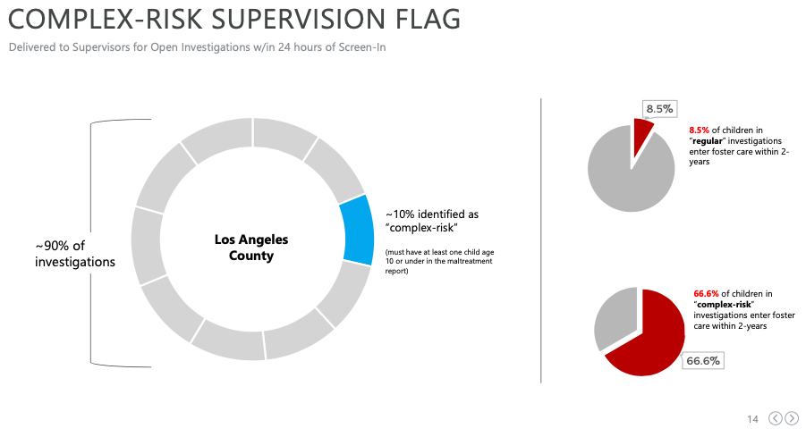
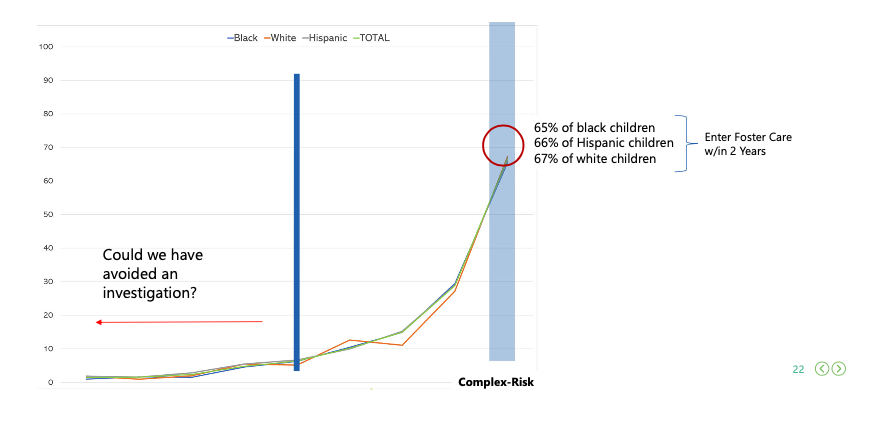

```{r setup, include=FALSE}
options(htmltools.dir.version = FALSE)

knitr::opts_chunk$set(
  fig.width=9, fig.height=3.5, fig.retina=3,
  out.width = "100%",
  cache = FALSE,
  echo = TRUE,
  message = FALSE,
  warning = FALSE,
  hiline = TRUE
)
```

```{r xaringan-themer, include=FALSE, warning=FALSE}
library(xaringanthemer)
style_duo_accent(
  primary_color = "#0B4662",
  secondary_color = "#530B62",
  inverse_header_color = "#FFFFFF"
)
```

```{r xaringanExtra, echo=FALSE}
library(xaringanExtra)
xaringanExtra::use_editable(expires = 1)
```

###Intro
.pull-left[
####Peter Horton
]
.pull-right[
####Warning
**Alphabet Soup**
]
---
name:toc
- *Background* / **History of Predictive Analytics in LA DCFS**
  
- *Present* / **Overview of the Risk Stratification Model**
  
- *Funding & Development* / **Who built it, and who's paying?**
  
- *Sources of Data* / **What does the tool see?**
  
- *Methodology* / **How does the tool work?**
  
---
name: SDM1
  .pagenote[*Background*/ **History of Predictive Analytics in LA DCFS**]
  .left-column[
  ##1998
  ##SDM
  ]

  .right-column[
- **SDM** = Structured Decision Making
- Developed by a nonprofit,  National Council on Crime and Delinquency (NCCD), now called Evident Change.
- **SDM** is used nationwide, and has been used in Los Angeles for about twenty years.  ]
---
name: SDM2
  .pagenote[*Background*/ **History of Predictive Analytics in LA DCFS**]
  .left-column[
  ##1998
  ##SDM
  ]
  .right-column[
- **SDM** is an *algorithm*, but it is not *automated*. Caseworkers answer questionnaires with simple, numerical answers. The sum of the answers leads to a risk score.
- **SDM**  tools are used throughout a DCFS case.
- DCFS uses **SDM** tools for **starting cases**, **removing children**, **reunifying families**, and **offering services.** ]
  
---
Name: SDM_images
class:inverse, center
  .pull-left[]
  .pull-right[]
---
name: SDM_point
  .pagenote[*Background*/ **History of Predictive Analytics in LA DCFS**]
  .left-column[
  ##What's your point?]
  .right-column[
- Los Angeles has been using a predictive algorithm for over 20 years.
- We should keep that in mind when listening to claims about how a new, more high tech predictive algorithm will help transform the system.]
  
---
name:AURA
  .pagenote[*Background*/ **History of Predictive Analytics in LA DCFS**]
  .left-column[
  ##2014
  ##Project AURA
  
  ]

  .right-column[
- AURA = Approach to Understanding Risk Assessment
- An automated tool, developed by SAS, a private company.
- The pilot was developed in 2014, and used only on historical data, not real cases.
- Assessment from a 2017 Office of Child Protection Report:
  > "While the tool correctly detected a high number of children (171 cases) at the highest risk for abuse, it also incorrectly identified an extremely high number (3,829 cases) of false positives (i.e., children who received high risk scores who were not at risk for a negative outcome). [...] DCFS is no longer pursuing Project AURA."

  ]
---
name:RSM
  .pagenote[*Background*/ **History of Predictive Analytics in LA DCFS**]
  .left-column[
  ##2021
  ##RSM
  ]
  .right-column[
- **RSM** = Risk Stratification Model
- An automated tool, developed by Children's Data Network, part of USC's Social Work school.
- A tool being created right **now**. The pilot was trained on historical data. It was then tested on real cases in fall 2021.]
  
---
## Overview of the Risk Stratification Model (RSM)
  The program has three parts:
- Uses historical DCFS data to make predictions.
- Identifies about 10% of DCFS cases as **complex-risk**.
- Presents information on **complex-risk** cases to supervisors.
---
name:overview1
class: inverse, center
  ## Overview of the RSM
  
---
name: funding_development
  .pagenote[*Funding & Development* / **Who built it, and who's paying?**]
  .pull-left[
  ###Funders
  
  ]
  .pull-right[
  ###Developers
  ]
---
name: data1
  .pagenote[*Sources of Data* / **What does the tool see?** ]
  ###Claims to Use Only DCFS Data
  
---
name: data2
  .pagenote[*Sources of Data* / **What does the tool see?** ]
  ###What Does DCFS Data Include?
  The tool developers emphasize that the **RSM** is different from the other tool they worked on, the **AFST**. While the **AFST** uses public records from multiple county agencies, the **RSM** only uses data from California's Child Welfare database (**CWS/CMS**).
---
name: data3
  .pagenote[*Sources of Data* / **What does the tool see?** ]
  .pull-left[
**What information would DCFS definitely have after a caseworker begins an investigation?**
.can-edit[
- Child's name
- Age
  ]
  ]
  .pull-right[
**What's some information DCFS might have that would be more surprising?**
.can-edit[
- ???
  ]
  ]
---
name:overview1
class: inverse, center
  ### What are they using that data for, exactly?
  
---
name: overview2
class: inverse, center
  ### What is complex-risk?
  
---
name: overview3
class: inverse, center
  ### What is complex-risk?
  
---
name: results1
  .pagenote[*Methodology* / **How does the tool work?**]
  .left-column[
  ##How will DCFS use the tool?]
  .right-column[
- Unlike **AFST** or **SDM**, the **RSM** tool doesn't suggest a decision to a caseworker.
- The **RSM** is meant to tell caseworkers to focus supervision on high risk cases or to transfer those cases to the most experienced caseworkers.]

---
name: results2
  .pagenote[*Methodology* / **How does the tool work?**]
  .left-column[
  ##How will DCFS use the tool?
  ]
  .right-column[
- DCFS and CDN have also said that the tool can help reduce racial bias. They say the tool can lead to:
> "Deep dive review to help identify whether many of these reports could have been (or should have been) screened out."
[...]
"Regional office review of potential community service needs, mandated reporter training that could address disparities."  
[...]
"Possible alternative investigation protocols initiated with community partners for low-complexity reports."  

]
---
#Questions
- Will a caregiver be told when an investigation is marked "complex-risk?"
- When caseworkers request data from other agencies, does that affect the risk score? Could that add racial bias?
- What are supervisors supposed to do for "complex-risk" families?
  - Do they have additional services and resources that would be helpful?
  - If so, why do those services need to come through DCFS?
---
#Next steps
- Possibly meeting with Jennie Feria, a lead on the project at DCFS.
- Submitting new PRA requests with more specific questions about the data that the tool uses and/or results from the initial pilot.

**Others?**
.can-edit[
- ?
  ]
